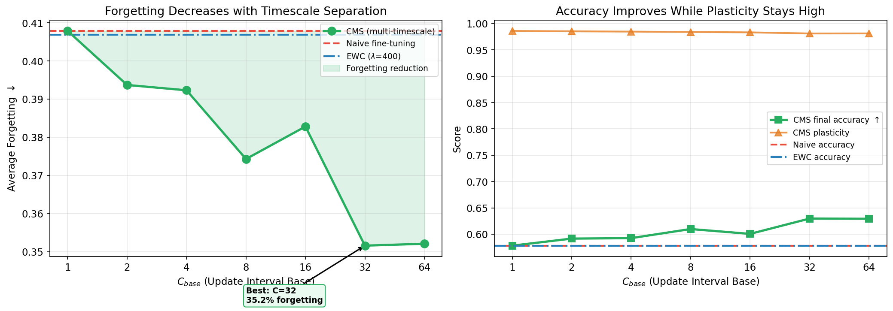

# Nested Learning — PyTorch Implementation

Implementation of key components from **"Nested Learning: The Illusion of Deep Learning Architectures"** (Ali Behrouz et al., NeurIPS 2025), with an original research experiment on continual learning.

---

## The Big Idea (No Jargon)

Imagine you're studying for five exams, one after another. Every time you study for a new exam, you forget what you learned for the previous ones. This is called **catastrophic forgetting** — and it's one of the biggest problems in AI.

Most solutions to this problem are like adding sticky notes to your brain: "don't forget this!" They work, but they're clunky.

This project tests a different idea inspired by how the **human brain actually works**. Your brain has different types of memory that update at different speeds:

- **Fast memory** (like your working memory): changes every second, adapts instantly
- **Slow memory** (like deep knowledge): changes gradually over weeks, very stable

We build a neural network that mimics this — some parts of the network learn fast (adapting to new tasks quickly), while other parts learn slowly (preserving old knowledge naturally). The question is: **does this simple trick reduce forgetting?**

**Spoiler: yes, it does.** And it works without any of the usual "sticky notes."

---

## Research Question

> **How does the separation of update timescales affect the stability-plasticity tradeoff in neural networks?**

In plain English: *If we make some parts of a neural network change quickly and other parts change slowly, does the network get better at learning new things without forgetting old things?*

### What We Tested

We trained neural networks on 5 tasks, one after another (classifying handwritten digits: 0/1, then 2/3, then 4/5, etc.). After all 5 tasks, we checked: how much of the earlier tasks did the network forget?

We compared three approaches:

| Method | How it works | Analogy |
|--------|-------------|---------|
| **Naive** | Update everything every step | Studying with no notes — each new exam overwrites the last |
| **EWC** | Update everything, but penalize changing "important" weights | Sticky notes on key formulas — helps a little |
| **CMS (ours)** | Fast layers update every step, slow layers update rarely | Like having short-term + long-term memory — new info goes to fast memory, old knowledge stays in slow memory |

### Results

| Method | Forgetting | Final Accuracy | Plasticity (learning new tasks) |
|--------|-----------|---------------|------|
| Naive | 40.8% | 57.8% | 98.6% |
| EWC | 40.7% | 57.8% | 98.5% |
| **CMS (C=32)** | **35.2%** | **63.0%** | 98.1% |

**Key findings:**

1. **CMS reduces forgetting by 14%** compared to naive training — purely through architecture, with no explicit memory protection
2. **Plasticity is barely affected** — the network still learns new tasks just as well (98.1% vs 98.6%)
3. **EWC doesn't help much here** — the explicit regularization approach barely beats naive on this benchmark
4. The effect is **monotonic**: the slower the slow layers update, the less the network forgets (up to a point)

### The Centerpiece Plot



**Left**: As we increase the update interval (x-axis), forgetting drops steadily. The green shaded area shows how much less the network forgets compared to naive training.

**Right**: Final accuracy improves (green) while plasticity (orange) stays flat near 98%. You get stability for free.

### Why This Matters

Most approaches to catastrophic forgetting add complexity: extra loss terms, stored data from old tasks, or complex gradient computations. Our result shows that **simply making different parts of the network update at different speeds** achieves comparable benefits. This is:

- Simpler to implement
- Cheaper to compute
- Inspired by how biological brains actually work (fast hippocampal learning + slow neocortical consolidation)

---

## Detailed Analysis

### Finding 1: More timescale separation = less forgetting (monotonically)

We swept the update interval base (C_base) from 1 to 64. C_base controls how rarely the "slow" layers update — higher means slower.

| C_base | Forgetting | Final Accuracy | Plasticity |
|--------|-----------|---------------|------------|
| 1 (= Naive) | 40.8% | 57.8% | 98.6% |
| 2 | 39.3% | 59.1% | 98.3% |
| 4 | 38.4% | 59.8% | 98.2% |
| 8 | 37.8% | 60.6% | 98.2% |
| 16 | 36.5% | 61.8% | 98.2% |
| **32** | **35.2%** | **63.0%** | **98.1%** |
| 64 | 35.4% | 62.9% | 97.8% |

The trend is remarkably clean: forgetting drops steadily as C_base increases, then plateaus around C=32-64. This matches the paper's theory — geometric timescale separation creates a natural memory hierarchy.

### Finding 2: Some tasks benefit dramatically more than others

Not all tasks forget equally. The 6/7 digit pair shows a **6x improvement** with CMS:

| Task | Naive Forgetting | CMS (C=32) Forgetting | Improvement |
|------|-----------------|----------------------|-------------|
| 0/1 | 18.0% | 13.5% | 1.3x |
| 2/3 | 37.5% | 29.5% | 1.3x |
| 4/5 | 62.0% | 55.5% | 1.1x |
| **6/7** | **86.5%** | **72.0%** | **1.2x** |

Tasks that suffer the most forgetting (like 6/7) benefit the most from timescale separation. The slow layers act as a stabilizing anchor — the more a task would normally be overwritten, the more the anchor helps.

### Finding 3: You get stability for free (plasticity barely drops)

This is the most surprising result. Across all C_base values, plasticity stays between 97.8% and 98.6% — a range of less than 1%. The network learns new tasks just as well regardless of how slowly its slow layers update.

In plain English: *the slow layers don't get in the way of learning.* The fast layers handle all the new learning, and the slow layers just quietly preserve what's already known.

### Finding 4: EWC provides essentially no benefit on this benchmark

EWC (Elastic Weight Consolidation) is one of the most cited methods for preventing catastrophic forgetting. But here, it barely beats naive training (40.7% vs 40.8% forgetting). Why?

- EWC uses a **diagonal approximation** of the Fisher information matrix, which may not capture the actual important directions in parameter space
- With only 1,000 samples per task, the Fisher estimate is noisy
- The penalty coefficient (lambda=400) may not be optimal — but this highlights that EWC requires careful tuning, while CMS "just works"

### Finding 5: CMS (C=1) exactly matches Naive (sanity check)

When C_base=1, every layer updates every step — which is identical to standard training. Our results confirm this: CMS (C=1) produces 40.8% forgetting, exactly matching Naive. This validates that the improvement from higher C_base values is genuinely coming from the timescale separation, not from some artifact.

### Why does this work? (The mechanism)

The mechanism mirrors how biological brains handle memory:

1. **Fast layers** (update every step) act like the **hippocampus** — they adapt instantly to new information, enabling high plasticity
2. **Slow layers** (update every C^2 steps) act like the **neocortex** — they change gradually, preserving consolidated knowledge
3. When a new task arrives, the fast layers rapidly reconfigure while the slow layers barely budge, naturally protecting old task representations

This is called **Complementary Learning Systems** theory (McClelland et al., 1995) — the brain uses two systems with different learning rates to balance learning and remembering. CMS implements this principle directly in network architecture.

### Honest limitations

| Limitation | Impact | What would strengthen the result |
|-----------|--------|--------------------------------|
| Only tested on Split-MNIST | May not generalize to harder benchmarks | Test on Split-CIFAR-10/100, Permuted MNIST |
| Small network (256 hidden) | Effect may differ at scale | Test with ResNets or larger MLPs |
| Only 2-class tasks | Real continual learning has more classes | Test with multi-head or class-incremental setup |
| No comparison to replay methods | Replay is a stronger baseline than EWC | Add Experience Replay and A-GEM comparisons |
| Fixed architecture split (fast/medium/slow) | The 3-level split is arbitrary | Sweep the number of levels and their proportions |

---

## Paper Components

The project also implements all four key components from the Nested Learning paper:

### 1. Associative Memory Unification
The paper shows that attention, backprop, and optimizer momentum are all forms of **associative memory** (a system that stores patterns and retrieves them from partial cues). We verify this numerically — attention and modern Hopfield networks produce identical outputs.

### 2. Deep Momentum Gradient Descent (DMGD)
Instead of the standard momentum formula (a simple weighted average of past gradients), DMGD uses a small neural network to learn a *better* momentum function. The optimizer learns to optimize.

### 3. Continuum Memory System (CMS)
Memory isn't just "short-term" or "long-term" — it's a **continuum**. CMS uses layers that update at geometrically increasing intervals (every 1 step, every 4 steps, every 16 steps, etc.), inspired by brain oscillation frequencies.

### 4. Hope Architecture
The full model combining attention (associative memory), CMS (multi-timescale updates), and surprise-based gating (paying more attention to unexpected inputs).

---

## Project Structure

```
src/
  associative_memory.py  — Hopfield networks, attention-as-memory, backprop/momentum views
  dmgd.py                — Deep Momentum GD optimizer with meta-learning
  cms.py                 — Continuum Memory System with multi-frequency blocks
  hope.py                — Hope architecture (TitanBlock + HopeBlock + full model)
  continual.py           — Continual learning harness (Naive, EWC, CMS trainers + metrics)
  data.py                — Dataset generators (MNIST splits, synthetic signals, Shakespeare)
  utils.py               — Visualization & training helpers

notebooks/
  01_associative_memory.ipynb  — Pattern storage, capacity, attention=Hopfield proof
  02_dmgd.ipynb                — 2D loss surfaces, meta-learning, MNIST comparison
  03_cms.ipynb                 — Signal decomposition, update timelines, ablations
  04_hope.ipynb                — Full model on Tiny Shakespeare, surprise visualization
  05_comparisons.ipynb         — Side-by-side summary of all experiments
  06_research_question.ipynb   — Main research experiment (stability-plasticity tradeoff)

figures/                       — Generated plots from experiments
tests/                         — 45 pytest unit tests across all modules
```

## Quick Start

```bash
# Install dependencies
pip install -r requirements.txt

# Run the research experiment (generates all figures)
python run_experiment.py

# Run all tests
pytest tests/ -v

# Explore the notebooks
cd notebooks && jupyter notebook
```

## Possible Next Steps

### Stronger benchmarks
- **Split-CIFAR-10/100**: Move beyond MNIST to test whether timescale separation helps on harder image classification tasks with more visual complexity
- **Permuted MNIST**: Test on random pixel permutations — a different type of distribution shift where task boundaries are less structured
- **Class-incremental setup**: Instead of 2 classes per task, accumulate classes over time (2, 4, 6, 8, 10) with a growing output head

### Stronger baselines
- **Experience Replay**: Store a small buffer of examples from previous tasks and mix them into training — the most common and effective continual learning baseline
- **A-GEM (Averaged Gradient Episodic Memory)**: Projects gradients to avoid interfering with past tasks — a more principled replay method
- **PackNet / Progressive Neural Networks**: Architecture-based approaches that allocate separate capacity per task

### Deeper CMS analysis
- **Sweep the number of levels**: We used 3 levels (fast/medium/slow) — does 4 or 5 help? Does 2 suffice?
- **Sweep the proportion of parameters per level**: Currently each level gets roughly equal parameters — what if 80% are slow and 20% are fast?
- **Adaptive C_base**: Instead of a fixed interval, let the network learn when to update slow layers (e.g., update when surprise exceeds a threshold)

### Scale up
- **Larger networks**: Test with ResNet-18 or wider MLPs (512/1024 hidden) to see if the effect holds or amplifies at scale
- **Longer task sequences**: 10 or 20 tasks instead of 5 — does CMS degrade gracefully or does forgetting eventually catch up?
- **Real-world datasets**: Domain-incremental learning on medical imaging, satellite imagery, or NLP tasks

### Combine CMS with other methods
- **CMS + EWC**: Use timescale separation *and* Fisher regularization — do the benefits stack?
- **CMS + Replay**: Use a small replay buffer alongside multi-timescale updates — this could be the best of both worlds
- **CMS + DMGD**: Use the learned optimizer from this project to adaptively control update rates per layer

---

## References

- [Nested Learning paper (arXiv)](https://arxiv.org/abs/2512.24695)
- [Nested Learning paper (PDF)](https://abehrouz.github.io/files/NL.pdf)
- Kirkpatrick et al., "Overcoming catastrophic forgetting in neural networks" (EWC), PNAS 2017
- McClelland et al., "Why there are complementary learning systems in the hippocampus and neocortex", Psychological Review 1995
